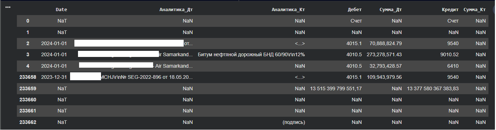
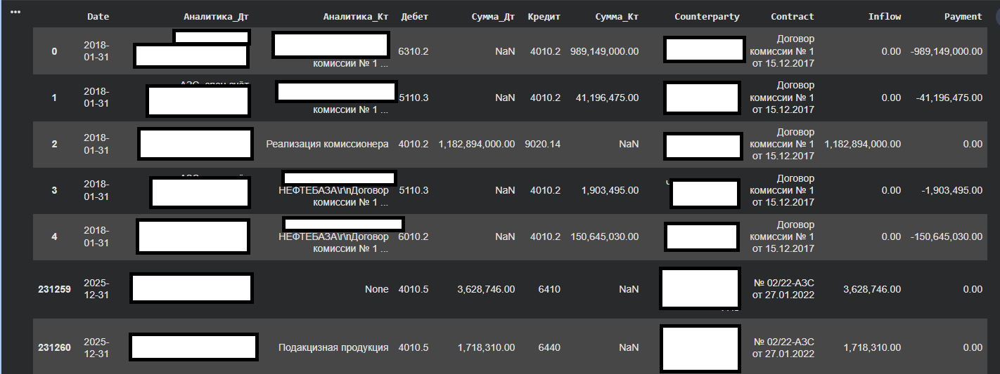
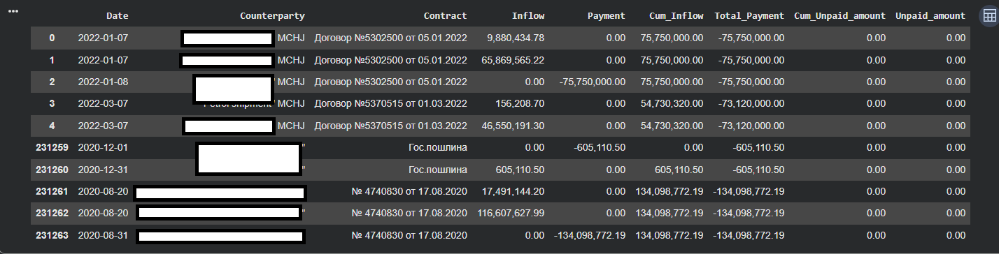
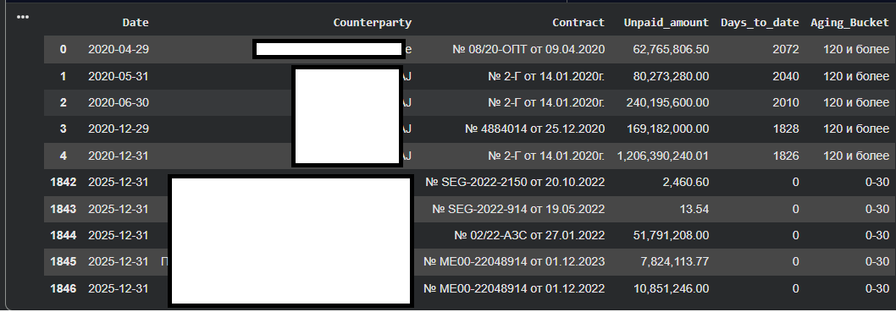
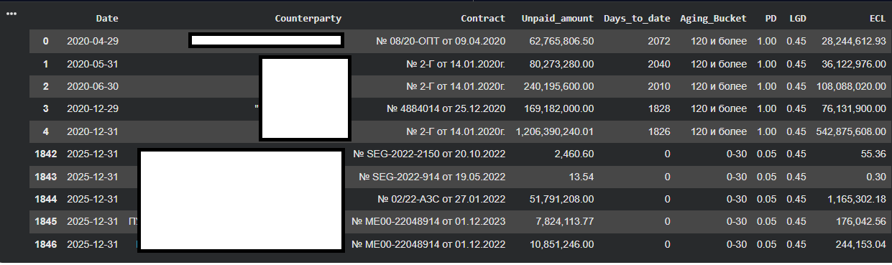

# IFRS 9 Expected Credit Loss (ECL) Automation

Проект демонстрирует автоматизацию расчета ожидаемых кредитных убытков (Expected Credit Loss, ECL) в соответствии с требованиями стандарта IFRS 9 с использованием Python (Pandas) и DuckDB SQL.

## Основные возможности

- Загрузка и объединение исходных данных по кредитному портфелю;
- Очистка и преобразование данных;
- Обработка данных с использованием Python (Pandas) и DuckDB SQL;
- Формирование расчетных параметров (PD, LGD, EAD);
- Автоматизированный расчет Expected Credit Loss (ECL);
- Формирование итоговой аналитческой таблицы;
- Экспорт результатов в Excel.

## Используемые технологии

**Python • Pandas • NumPy • DuckDB SQL • IFRS 9 • ECL • ETL • Excel**

## Исходный код проекта

Полная реализация ETL-процесса и расчета IFRS 9 ECL доступна в ноутбуке:

[📓 Открыть Jupyter Notebook](./IFRS_9_ECL_automatization_ipynb)

## Практическое применение

Проект разработан на основе реального сценария автоматизации подготовки расчетов по IFRS 9. Решение демонстрирует обработку больших массивов финансовых данных, расчет ключевых параметров кредитного риска (PD, LGD, EAD) и автоматизацию формирования ожидаемых кредитных убытков (ECL) для дальнейшего использования в финансовой отчетности и BI-системах. Исходные данные и пути к источникам обезличены для публичной публикации.

## Примеры этапов обработки данных

### 1. Загрузка и подготовка исходных данных

### 2. Очистка и преобразование данных

### 3. Формирование расчетных параметров (PD, LGD, EAD)

### 4. Анализ просроченной задолженности (Aging Bucket Analysis)

### 5. Расчет Expected Credit Loss (ECL)

